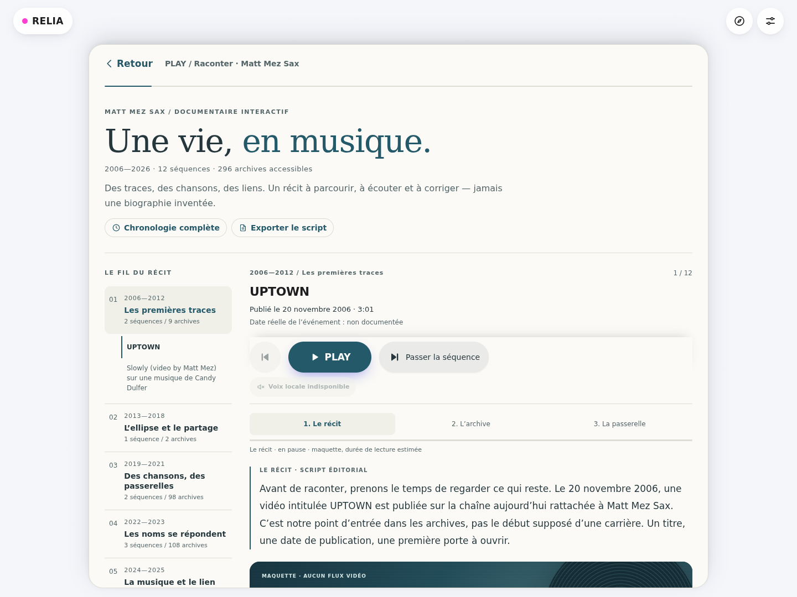
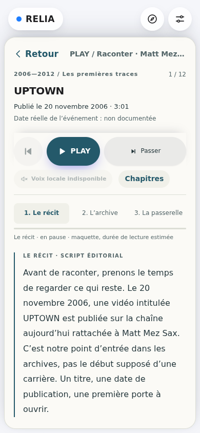
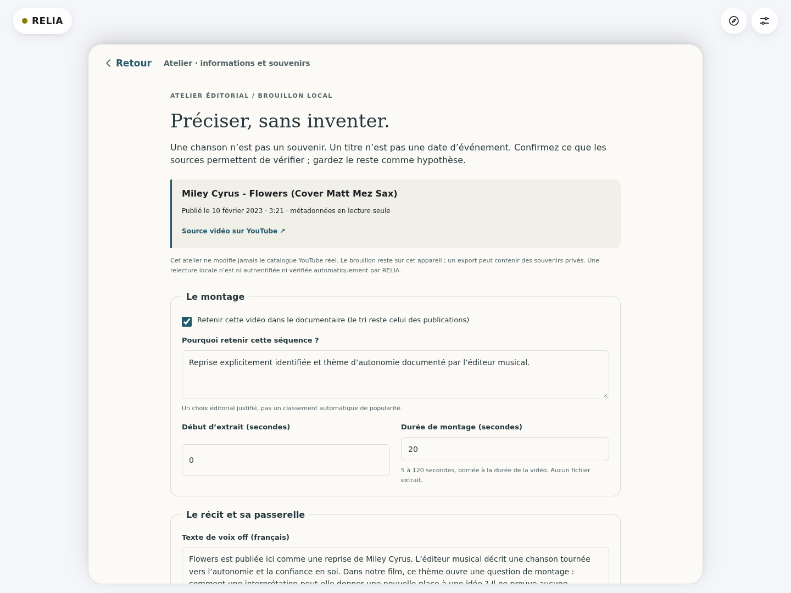

# RELIA — Raconter une vie en musique

**Prototype documentaire · 10 octobre 2026**

Dépôt : `mattmezstitchlab/RELIA` · branche : `arena/b9ead098-relia`

Cette livraison est un récit textuel navigable et une maquette de lecture, avec atelier éditorial local. **Pas de fusion automatique, pas de publication Vercel, pas de génération vocale payante.**

## Découvrir le prototype

- Accueil → **Raconter une vie en musique**.
- Accès direct : `/#raconter/matt-mez-sax`.
- Archives indépendantes : `/#chronologie/matt-mez-sax`.
- Le documentaire s’ouvre **en pause**, voix désactivée, sans lecteur YouTube chargé. Sur mobile, le premier passage et PLAY sont immédiatement visibles ; le bouton **Chapitres** retrouve la navigation.
- **PLAY / Pause**, précédent et **Passer la séquence** réutilisent les commandes du mode Raconter. Les trois moments sont accessibles séparément : récit → archive → passerelle.
- **Confirmer / corriger cette séquence** ouvre l’atelier. Depuis la chronologie complète, chaque vidéo dispose aussi de **Informations musicales & souvenir**, même hors de la sélection initiale.
- **Exporter le script** produit le texte Markdown avec ses sources. L’atelier local permet d’exporter/importer le brouillon JSON et de retirer les corrections d’une vidéo.





## Un montage limité, pas une playlist de 296 vidéos

Le catalogue existant contient **296 publications**, de novembre 2006 à mars 2026. Le prototype retient **12 vidéos réelles**, réparties en six fenêtres de publication :

| Période | Chapitre | Séquences | Archives accessibles |
| --- | --- | ---: | ---: |
| 2006–2012 | Les premières traces | 2 | 9 |
| 2013–2018 | L’ellipse et le partage | 1 | 2 |
| 2019–2021 | Des chansons, des passerelles | 2 | 98 |
| 2022–2023 | Les noms se répondent | 3 | 108 |
| 2024–2025 | La musique et le lien | 3 | 78 |
| 2026 | Un présent ouvert | 1 | 1 |

**Durée indicative : 10 min 44 s**, soit environ 11 minutes, à 150 mots/minute pour la lecture du texte et avec douze extraits de montage de 20 secondes. Ce n’est pas la durée d’un audio généré. La durée réelle dépendra de la voix, des pauses et du lecteur. Les extraits sont bornés à la durée disponible ; aucun fichier vidéo ou audio n’est extrait.

Les chapitres décrivent les publications conservées, **pas des étapes biographiques établies**. Une lacune du catalogue ne prouve pas une absence d’activité.

### Sélection vérifiable

Dates ci-dessous : **publication YouTube**, jamais tournage ou événement. Toutes les dates réelles d’événement restent non documentées dans la version éditoriale livrée.

| Publication | Vidéo réelle / lien | Traitement musical |
| --- | --- | --- |
| 20/11/2006 | [UPTOWN](https://www.youtube.com/watch?v=XgKcenvjMdI) | Œuvre et reprise/original inconnus. Point d’entrée dans l’archive, pas début de carrière. |
| 10/10/2011 | [Slowly — vidéo de Matt Mez, musique de Candy Dulfer mentionnée](https://www.youtube.com/watch?v=YT9M8JSJqwY) | Le nom cité ne suffit pas à identifier le morceau ni son statut. |
| 04/09/2018 | [Mariage / ouverture de bal — Helium](https://www.youtube.com/watch?v=q9kVRm-ApXc) | Reprise déclarée par le titre explicite « Cover ». Attribution originale à Sia encore à vérifier ; date de cérémonie inconnue. |
| 02/01/2019 | [Shallow](https://www.youtube.com/watch?v=-mTxWSZW6ME) | Reprise déclarée ; artistes et quatre auteurs vérifiés dans une notice musicale autorisée. |
| 12/08/2021 | [Always Remember Us This Way — Matt Mez Sax & Juliette Djender](https://www.youtube.com/watch?v=PRAnYsdEC2M) | Reprise déclarée ; noms présents dans le titre. Ni début du duo ni crédits originaux déduits. |
| 15/07/2022 | [Hymne à l’amour — Duo Butterfly](https://www.youtube.com/watch?v=1X3dI1w3qTY) | Identification d’œuvre gardée comme hypothèse ; pas d’attribution automatique à Édith Piaf. |
| 22/01/2023 | [Shallow — seconde publication retenue](https://www.youtube.com/watch?v=VyOYHeLM-9k) | Rappel éditorial de 2019 ; aucune explication biographique de ce retour. |
| 10/02/2023 | [Flowers](https://www.youtube.com/watch?v=wYbC0r8Vc68) | Reprise, crédits et thème d’autonomie documentés. Aucune séparation privée inférée. |
| 10/10/2024 | [Ehpad — anniversaire 100 ans d’une résidente](https://www.youtube.com/watch?v=3k8uuhyIVCc) | Citation du contexte annoncé dans le titre uniquement. Pas de date d’anniversaire, d’état de santé ni d’effet thérapeutique déduits. |
| 17/05/2025 | [You Raise Me Up](https://www.youtube.com/watch?v=mdqILjZhhw0) | Secret Garden distingué de la référence Josh Groban ; auteurs et encouragement documentés. |
| 24/05/2025 | [Photograph](https://www.youtube.com/watch?v=By6BUKObbNs) | Crédits et amour à distance documentés. Le rapprochement avec la mémoire est éditorial ; aucune croyance religieuse inférée du titre. |
| 11/03/2026 | [Presence](https://www.youtube.com/watch?v=ZK2gy2XUCDc) | Ni chanson identifiée ni composition originale présumée. Une fin ouverte. |

## Ce que les sources permettent de dire

### Métadonnées vidéo

Le catalogue existant provient de YouTube Data API v3, capturé le **10 octobre 2026**, pour les chaînes rattachées par déclaration du propriétaire à la fiche `relia:person:matt-mez-sax` : `@mezofon` et `@mattmezsax`.

Pour les **296 vidéos**, la couche documentaire sépare :

1. titre exact de la vidéo et publication, lus dans le catalogue ;
2. date réelle de l’événement, uniquement avec un document d’événement ;
3. œuvre proposée ou identifiée ;
4. artiste de l’œuvre originale, interprétation de référence et auteurs crédités ;
5. reprise déclarée / composition originale / statut inconnu ;
6. résumé du sens, sources, confiance, souvenirs et statut éditorial.

**Un titre n’est jamais automatiquement un titre de chanson.** La sélection comporte sept reprises explicitement déclarées, une identification hypothétique et quatre œuvres inconnues. Les crédits musicaux autorisés couvrent quatre œuvres, présentes dans cinq vidéos sélectionnées. Les autres informations restent à vérifier, pas à compléter automatiquement.

### Notices musicales exploitées

Pages consultées le **10 octobre 2026**. Les synthèses françaises sont originales. Les descriptions commerciales ne sont pas prises pour une preuve de la vie de Matt Mez Sax. Aucun achat, téléchargement de partition/audio ou reproduction de paroles intégrales.

| Œuvre | Source autorisée | Éléments exploités / limite |
| --- | --- | --- |
| Flowers | [Alfred Music · 00-50748](https://www.alfred.com/products/flowers-00-50748) | Enregistrement de Miley Cyrus ; Michael Pollack, Gregory Aldae Hein, Miley Cyrus crédités pour paroles et musique. Présentation de l’éditeur : autonomie / confiance en soi. Alan Billingsley est l’arrangeur, pas un auteur original. |
| Shallow | [Hal Leonard · HL07013434](https://www.halleonard.com/product/7013434/shallow-from-a-star-is-born) | Lady Gaga et Bradley Cooper ; Stefani Germanotta, Anthony Rossomando, Andrew Wyatt, Mark Ronson. Contexte *A Star Is Born*. **Pas de thème amoureux confirmé** depuis cette seule notice. Rick Stitzel est l’arrangeur. |
| You Raise Me Up | [Secret Garden · histoire officielle](https://www.secretgarden.no/ourstory) | Rattachement de l’œuvre à Secret Garden, distinct des reprises ultérieures. |
| You Raise Me Up | [Hal Leonard · HL08744081](https://www.halleonard.com/product/8744081/you-raise-me-up) | Josh Groban comme version de référence ; Brendan Graham et Rolf Løvland crédités. Description : espoir / encouragement. Josh Groban n’est pas présenté comme artiste original ; Roger Emerson est l’arrangeur. |
| Photograph | [Hal Leonard · Discovery Choral](https://www.halleonard.com/product/1206361/photograph-arr-cristi-cary-miller) | Ed Sheeran ; **Tom Leonard, Johnny McDaid, Martin Peter Harrington, Ed Sheeran** — les quatre noms de la notice sont conservés. Contexte d’amour à distance. Cristi Cary Miller est l’arrangeuse. |

Les sources de chaque fait et du script sont visibles dans le documentaire. Les notices non probantes, les sites non autorisés de paroles et la page musicale actuelle d’Ed Sheeran n’ont pas servi à confirmer ces faits.

### Interprétation narrative, pas biographie

Exemple : le thème d’autonomie de *Flowers* est documenté. Le lien avec la période 2023 est un **choix de montage**, pas la preuve d’une rupture. *Photograph* permet de parler d’amour à distance ; le miroir entre son titre et le travail d’archive est une proposition éditoriale. Les transitions sont originales et ne transforment jamais ces thèmes en événements personnels.

## L’atelier : préciser sans inventer



- Métadonnées YouTube **en lecture seule** : ni titre, ni publication, ni chaîne modifiés par le formulaire.
- Sélection, justification et bornes d’extrait éditables ; ordre toujours fourni par la chronologie existante.
- Script et passerelle distincts des données musicales et de toute génération audio.
- Statuts **non documenté / hypothèse / confirmé après relecture**, avec confiance et sources propres à chaque information.
- Une nouvelle confirmation exige nom de relecture, date, justification et attestation de consultation. Ce sont des **déclarations humaines non authentifiées**, pas une certification automatique de RELIA.
- Les crédits et thèmes confirmés nécessitent une source musicale autorisée déclarée ; une date d’événement ou un souvenir confirmé exige un document de cet événement. Un souvenir personnel seul reste non corroboré.
- Un souvenir n’est **jamais injecté automatiquement** dans le script.
- Changer l’œuvre suspend les anciens crédits et thèmes non révisés. Modifier un fait cité, un script, une source vidéo croisée ou ses métadonnées peut bloquer PLAY jusqu’à adaptation et relecture.
- Enregistrer un souvenir ou un choix de montage ne reconfirme ni ne redate les faits inchangés. Réordonner des citations ne vaut pas nouvelle relecture.
- Sources indisponibles / périmées : signalement, suspension de la narration, conservation du brouillon. Une vidéo retirée est omise, jamais remplacée par une vidéo inventée.
- Confirmation avant sortie d’un formulaire modifié ; avertissement natif de fermeture/rechargement lorsque le navigateur le permet.

Les brouillons utilisent `localStorage`, sous `relia-documentary-v1:relia:person:matt-mez-sax`. **Ils ne sont ni synchronisés ni chiffrés.** Ils sont liés au navigateur et à l’origine du site : exporter avant de changer d’appareil, d’origine d’aperçu ou d’effacer les données locales. En cas de quota/refus du stockage, le travail reste en mémoire de session avec avertissement et export possible.

L’import JSON remplace le brouillon uniquement après confirmation et validation complète : schéma fermé, identité, types, sources, URL HTTPS sans identifiants/paramètres secrets, limites de longueur et **1 Mo maximum**. Un import invalide ne modifie rien. Les imports concurrents et les lectures retardées après navigation / correction sont protégés contre l’écrasement d’un travail plus récent. L’export JSON peut contenir des souvenirs privés : **ne pas le publier dans Git ou dans la PR**.

RELIA ne vérifie pas automatiquement la sémantique du texte libre ni l’autorité réelle d’un lien ajouté. Le choix du type de source ne transforme pas un site quelconque en éditeur autorisé. La relecture reste indispensable.

## Lecture et voix : pas de service payant dans cette livraison

### Maquette par défaut

Aucun lecteur externe ni voix à l’ouverture directe du documentaire. PLAY simule l’enchaînement par un minutage de lecture textuelle. Les extraits de maquette ne sont pas des flux vidéo. Le texte complet reste consultable en pause, et les séquences peuvent être passées manuellement.

### YouTube, sur accord explicite de séance

**Autoriser YouTube pour cette séance** permet le chargement du SDK lorsque PLAY atteint l’archive ; l’accord seul ne lance pas de média. Le lecteur officiel utilise `youtube-nocookie.com`, l’origine effective de la page, un referrer adapté, les commandes natives et les bornes choisies. Aucune clé API YouTube dans le navigateur, aucun proxy/téléchargement/extraction du flux.

En lecture réelle, la fin d’extrait et la progression viennent **du lecteur**, pas d’une minuterie fictive. Buffering, pause native, refus d’intégration, blocage autoplay et délais de chargement ont un repli explicite vers le texte, le lien externe ou la maquette. Les anciens callbacks sont invalidés après pause, changement ou sortie. Les médias sont coupés avant la narration suivante, y compris une archive précédemment ouverte dans la chronologie indépendante.

Le consentement n’est pas stocké. Revenir à la maquette ou quitter le documentaire retire l’iframe ; cela n’annule pas les données déjà transmises au fournisseur. Le SDK chargé peut rester en mémoire jusqu’à fermeture de la page. La chronologie complète conserve sa présentation antérieure, notamment ses miniatures externes : la vérification « zéro appel externe à l’ouverture » concerne **l’arrivée directe dans le documentaire**, pas toutes les fonctions historiques de RELIA.

### Voix locale optionnelle

Le moteur `VoiceNarrator` existant peut lire le script avec une voix française signalée `localService: true` par le navigateur, uniquement après activation. Une préférence de voix distante n’est pas réutilisée dans le documentaire. Sans voix locale, le texte et son minutage restent disponibles ; une erreur vocale met le récit en pause plutôt que d’enchaîner silencieusement.

Le français chaleureux est d’abord dans le **script original**. La qualité vocale dépend de l’appareil ; aucune voix « naturelle premium » n’est promise. Pas de clonage ni d’imitation autorisée/présumée d’une personne réelle, et aucun appel TTS cloud réalisé.

### Étape ultérieure, uniquement après accord

Pour une voix plus naturelle :

1. valider le montage, les textes, sources et corrections avant génération ;
2. choisir une voix synthétique générique autorisée, écouter un court essai et accepter explicitement le budget ;
3. utiliser un service serveur/private, authentifié, avec secret hors Git et **jamais dans une variable `VITE_*` ou un bundle client** ;
4. associer chaque clip à une empreinte cryptographique de la version du script, langue et paramètres de voix ;
5. conserver script et audio séparément, invalider l’audio après correction, puis resynchroniser sur les durées réellement mesurées ;
6. ne jamais envoyer de souvenirs privés sans consentement distinct.

Aucun endpoint payant, fournisseur vocal ou secret nouveau n’est configuré ici. Cette étape n’est pas lancée par la PR.

## Architecture conservée

- `src/data/youtube/matt-mez-sax.json` : catalogue public existant, **inchangé octet pour octet**.
- `src/catalog.js`, `src/youtube/catalog.js`, **`src/dates.js`** : mêmes adaptateurs et **unique moteur chronologique**. Les événements documentés deviennent des entrées distinctes des contenus ; leur date ne redéfinit pas l’ordre des publications.
- `src/documentary/model.js` : couche éditoriale, validation, bornes, sources et invalidation. Les empreintes FNV détectent des changements ; ce ne sont pas des preuves cryptographiques de vérité.
- `src/documentary/matt-mez.js` : sélection, chapitres, faits relus et transitions originales. Pas de second catalogue actif : les métadonnées structurées restent celles du catalogue ; les brouillons persistent la couche éditoriale et ses empreintes. Les scripts citent naturellement les faits relus.
- `storage.js`, `editor.js`, `view.js` : atelier privé local, présentation textuelle et commandes communes déplacées/restaurées sans duplication.
- `playback.js`, `youtube-player.js` : séquenceur de médias injectable, SDK paresseux et contrat du lecteur officiel ; pas un moteur chronologique supplémentaire.
- `src/narration.js` : option locale pour le documentaire ; comportement du récit historique conservé.
- Aucun changement du synchroniseur YouTube ni de son workflow main-only. Aucun déclenchement de synchronisation pour cette livraison.
- `vercel.json` : déploiement Git automatique désactivé **seulement** pour `arena/b9ead098-relia`. Ce garde-fou est inclus dans le commit avant le push ; les autres branches ne sont pas reconfigurées.

SHA-256 du catalogue conservé :

```text
e48339b7ca5eab1330d4693f9525ba09546d33749714c1e871466877d8f9ba80
```

## Vérifications et reproduction

```sh
npm ci
npm test
npm run build

# Tests navigateur / accessibilité, avec un Chromium standard installé :
npx playwright install chromium
npm run test:e2e

# Découverte manuelle :
npm run dev
# puis /#raconter/matt-mez-sax
```

Node ≥ 22.12.0. Playwright et axe sont des dépendances de développement, pas du bundle public. Un Chromium préinstallé peut être indiqué par `PLAYWRIGHT_CHROMIUM_EXECUTABLE`, avec `PLAYWRIGHT_CHROMIUM_ARGS` (tableau JSON). Ne pas désactiver la sécurité web pour valider l’intégration. Aucun navigateur binaire, cache, dossier `dist/` ni export de souvenirs n’est versionné.

Résultats de validation de cette livraison :

- **272 tests Node réussis** : les 187 tests existants, plus 85 couvrant modèle, séparation des dates, absence d’identification automatique, sources/crédits, invalidation croisée, stockage/import, transport, lecteur YouTube et voix locale.
- **34 tests Playwright** : 17 parcours exécutés sur ordinateur et mobile — ouverture sans média/voix, navigation, restauration des contrôles, lecture mock-up, souvenirs, texte littéral/XSS, relecture, sortie protégée, stockage refusé, imports concurrents, export, sélection vide, lecteur et ancien mode Raconter.
- Contrôles axe WCAG 2 A/AA et 2.1 AA sur les composants documentaire/atelier : **aucune violation des règles testées**, en clair/sombre et grands textes. Vérification complémentaire à 320 px, sans débordement horizontal. Ce n’est pas une certification exhaustive d’accessibilité.
- **Build de production réussi**, y compris l’entrée indépendante `seating.html`. Seul avertissement : le chunk du graphe Three.js, déjà présent, dépasse 500 ko.
- `npm ci` reproductible ; **audit npm : zéro vulnérabilité** ; catalogue et moteur de dates inchangés ; `git diff --check` sans erreur.

**Limite du contrôle média :** l’environnement restreint ne permet pas de vérifier une diffusion YouTube réelle ni l’écoute d’une vraie voix installée. Les contrats SDK/iframe et synthèse ont été testés avec doubles dans le navigateur et tests unitaires. Les captures de l’interface utilisent la véritable sélection du catalogue, sans ces données fictives de test. Une écoute réelle sur l’appareil cible reste à faire après validation éditoriale.

La PR vise `main` et reste **non fusionnée**. Le SHA du commit livré et l’URL de PR sont fournis dans le compte rendu de livraison, sans inscrire une référence auto-référentielle dans ce fichier.
